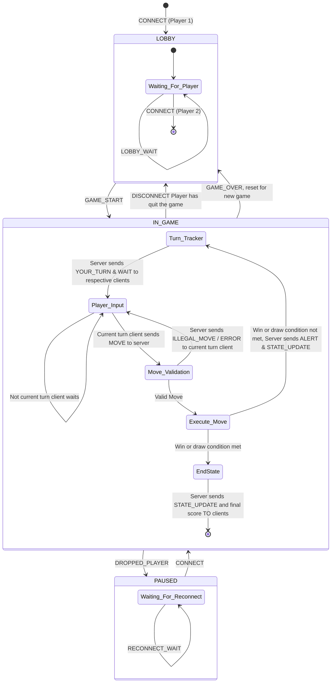

# CS 457 Project Statement of Work (SOW) & Protocol Specification Template

**Student Name:** Evan Zamore
**Date:** 2026-09-20  
**Course:** CS 457 - Computer Networks  
**Target Server Domain:** `server.zamore.edu`  

---

## 1. Game Selection & Scope (Sprint 0)

> Planning is going to be an iterative process through the sprints so you don't have to have all the details now. Focus on big overview concepts. You will be updating the SOW as we plan.
> You have a lot of freedom to choose a game. There are a couple caveats.  

> - It must run in the console. The lab nodes won't be able to handle extensive graphics.
> - It has to be self-contained. You can use a internet-connector to download you code, but because the architecture must run 5 nodes you won't be able to run 
> - You are encouraged to use python, but I'm not going to make it a strict requirement. The instructor and TA's ability to help with C or Rust, etc will be diminished in other languages.

### 1.1 Game Overview
- **Chosen Game:** Global Thermonuclear War (From the movie 'Wargames')
- **Player Capacity:** 2 Players (Simulated via 2 CML Client nodes)
- **Game Summary:** A strategic game where the players choose to play as either the Coldwar era super powers of the United States or the Soviet Union. The players choose strategic enemy locations to launch nuclear attacks against in an *attempt* to win a global thermonuclear war.

### 1.2 Core Game Rules & Win/Draw Conditions
- **Turn Mechanics:** Each player will have a set amount of time in which to make their move(s), during player 1's turn player 2 will be blocked from making any moves and vice versa. A player will be able to pass on their turn if they do not want to make a move.
- **Victory Condition:** *Ahem* For a player to win they must destory the opponents capital city.
- **Draw/Tie Condition:** If the capital cities of the opposing countries are destroyed the game will end in a tie. Mutually Assured Destruction.

### 1.3 GitHub Repository Link
- https://github.com/Peter-Parrot/CS-457-GTNW

---

## 2. Application-Layer Messaging Protocol Blueprint (Sprint 1 Deliverable)

### 2.1 Message Transport & Serialization Format
- **Transport Protocol:** TCP
- **Serialization Format:** Fixed-Width Binary Header
- **Framing Mechanism:** 2-byte big-endian length prefix

### 2.2 Message Schema Definitions

#### Message Types:
1. `CONNECT` (Client -> Server): Request to join the game room.
2. `LOBBY_WAIT` (Server -> Client): Notification that server is waiting for Player 2.
3. `GAME_START` (Server -> Clients): Game initiated, assigns roles (e.g. Player X vs Player O).
4. `YOUR_TURN` (Server -> Client): Inform player that it is their turn.
5. `MOVE` (Client -> Server): Player action (e.g., cell coordinates or answer choice).
6. `WAIT` (Server -> Client): Player needs to wait fo the other player to take their turn.
7. `ILLEGAL_MOVE` (Server -> Client): Player has made an illegal move, player needs to re-do their move.n a vague alert
8. `ALERT` (Server -> Clients): Inform players of game conditions (Missle launches, radiation levels, DEFCON levels, etc.).
9. `STATE_UPDATE` (Server -> Clients): Broadcast current game board / state and active player turn.
10. `GAME_OVER` (Server -> Clients): Victory / Draw notification with final scores.
11. `ERROR` (Server -> Client): Invalid move or malformed packet error.
12. `DISCONNECT` (Client -> Server): Client notifies server of intentional departure/quit.
13. `DROPPED_PLAYER` (Server -> Client): A player's connection has been lost
14. `RECONNECT_WAIT` (Server -> Client): Waiting for the dropped player to reconnect

#### JSON Protocol Schema:
```json
{
  "definitions": {
    "CONNECT": {
      "type": "object",
      "properties": {
        "type": { "const": "CONNECT" },
        "timestamp": { "type": "number" },
        "session_id": { "type": "string" }
      },
      "required": ["type", "timestamp", "session_id"]
    },
    "LOBBY_WAIT": {
      "type": "object",
      "properties": {
        "type": { "const": "LOBBY_WAIT" },
        "timestamp": { "type": "number" },
        "message": { "type": "string" }
      },
      "required": ["type", "timestamp", "message"]
    },
    "GAME_START": {
      "type": "object",
      "properties": {
        "type": { "const": "GAME_START" },
        "timestamp": { "type": "number" },
        "role": { "type": "string" }
      },
      "required": ["type", "timestamp", "role"]
    },
    "YOUR_TURN": {
      "type": "object",
      "properties": {
        "type": { "const": "YOUR_TURN" },
        "timestamp": { "type": "number" }
      },
      "required": ["type", "timestamp"]
    },
    "MOVE": {
      "type": "object",
      "properties": {
        "type": { "const": "MOVE" },
        "timestamp": { "type": "number" },
        "action": { "type": "string", "enum": ["scan", "build abm", "launch"] },
        "coordinate": { "type": "string" }
      },
      "required": ["type", "timestamp", "action", "coordinate"]
    },
    "WAIT": {
      "type": "object",
      "properties": {
        "type": { "const": "WAIT" },
        "timestamp": { "type": "number" }
      },
      "required": ["type", "timestamp"]
    },
    "ILLEGAL_MOVE": {
      "type": "object",
      "properties": {
        "type": { "const": "ILLEGAL_MOVE" },
        "timestamp": { "type": "number" },
        "reason": { "type": "string" }
      },
      "required": ["type", "timestamp", "reason"]
    },
    "ALERT": {
      "type": "object",
      "properties": {
        "type": { "const": "ALERT" },
        "timestamp": { "type": "number" },
        "message": { "type": "string" }
      },
      "required": ["type", "timestamp", "message"]
    },
    "STATE_UPDATE": {
      "type": "object",
      "properties": {
        "type": { "const": "STATE_UPDATE" },
        "timestamp": { "type": "number" },
        "status": { "type": "string" },
        "board": { "type": "array", "items": { "type": "integer" } }
      },
      "required": ["type", "timestamp", "status", "board"]
    },
    "GAME_OVER": {
      "type": "object",
      "properties": {
        "type": { "const": "GAME_OVER" },
        "timestamp": { "type": "number" },
        "result": { "type": "string" },
        "message": { "type": "string" }
      },
      "required": ["type", "timestamp", "result", "message"]
    },
    "ERROR": {
      "type": "object",
      "properties": {
        "type": { "const": "ERROR" },
        "timestamp": { "type": "number" },
        "error_message": { "type": "string" }
      },
      "required": ["type", "timestamp", "error_message"]
    },
    "DISCONNECT": {
      "type": "object",
      "properties": {
        "type": { "const": "DISCONNECT" },
        "timestamp": { "type": "number" }
      },
      "required": ["type", "timestamp"]
    },
    "DROPPED_PLAYER": {
      "type": "object",
      "properties": {
        "type": { "const": "DROPPED_PLAYER" },
        "timestamp": { "type": "number" },
        "message": { "type": "string" }
      },
      "required": ["type", "timestamp", "message"]
    },
    "RECONNECT_WAIT": {
      "type": "object",
      "properties": {
        "type": { "const": "RECONNECT_WAIT" },
        "timestamp": { "type": "number" },
        "message": { "type": "string" }
      },
      "required": ["type", "timestamp", "message"]
    }
  }
}
```

---

### 2.3 Game State Machine (FSM) Design (Sprint 1 Deliverable)


---

## 3. Game Behavior & Server Concurrency Architecture (Sprint 2 Deliverable)

### 3.1 Server Concurrency Strategy
- **Architecture Choice:** [Multi-Threading (`threading.Thread`) OR Non-blocking I/O multiplexing (`select.select` / `selectors`)]
- **Synchronization Logic:** Explain how shared game state and client list are thread-safe (e.g. `threading.Lock`) to prevent race conditions during turn processing.

### 3.2 State & Score Synchronization Across Clients
- **Turn Enforcement:** Detail how the server validates active player ID before processing moves and broadcasts updated turn notifications to all clients.
- **Score & Board Synchronization:** Describe how state broadcasts keep client screens synchronized in real time.

---

## 4. Coding & AI Implementation Plan (Sprint 3)

- **Permitted AI Tools:** [e.g., GitHub Copilot, ChatGPT, Claude]
- **AI Prompting & Constraint Strategy:** Explain how you will constrain AI models to generate code (in Python or your chosen language) that adheres strictly to the protocol blueprint and FSM designed in Sprints 1 & 2.
- **Implementation Risk Management:** Detail your plan to leverage past programming experience and manage time to ensure code completion on schedule.

---

## 5. CML Multi-Subnet Topology & Wireshark Deployment Plan (Sprint 4 & 5 Deliverable)

> For now you can use the topology below. We may update this when we get to defining subnets.

### 5.1 Subnet & Router Design
- **Subnet A (Client 1):** `192.168.10.0/24` (Interface `Gi0/1` on Router R1)
- **Subnet B (Client 2):** `192.168.11.0/24` (Interface `Gi0/2` on Router R1)
- **Subnet C (Game Server):** `192.168.20.0/24` (Interface `Gi0/1` on Router R2)
- **Router Backbone:** `10.0.0.0/30` (Interface `Gi0/0` on R1 <-> `Gi0/0` on R2)

### 5.2 DHCP Pools & DNS Configuration Plan
- **Router R1 DHCP Pool 1 (`CLIENT1_POOL`):** Leases `192.168.10.10` - `192.168.10.50`, gateway `192.168.10.1`, DNS `10.0.0.2`.
- **Router R1 DHCP Pool 2 (`CLIENT2_POOL`):** Leases `192.168.11.10` - `192.168.11.50`, gateway `192.168.11.1`, DNS `10.0.0.2`.
- **Router R2 Authoritative DNS:** Configured with `ip dns server` and static host mapping `server.[yourlastname].edu` -> `192.168.20.100`.

### 5.3 Deployment Strategy & Wireshark Trace Capture
- **CML Deployment Strategy:** Deploy `server.py` onto Subnet C node (`192.168.20.100`) behind Router R2, and `client.py` onto Subnet A and Subnet B nodes behind Router R1.
- **Cisco Infrastructure Configuration:** Router R1 DHCP pools (`CLIENT1_POOL`, `CLIENT2_POOL`) and Router R2 authoritative DNS (`ip host server.[lastname].edu 192.168.20.100`).
- **Wireshark Trace Capture Plan:** Capture DHCP DORA exchange (`dhcp_negotiation.pcap`) and DNS query/response resolution (`dns_lookup.pcap`).
