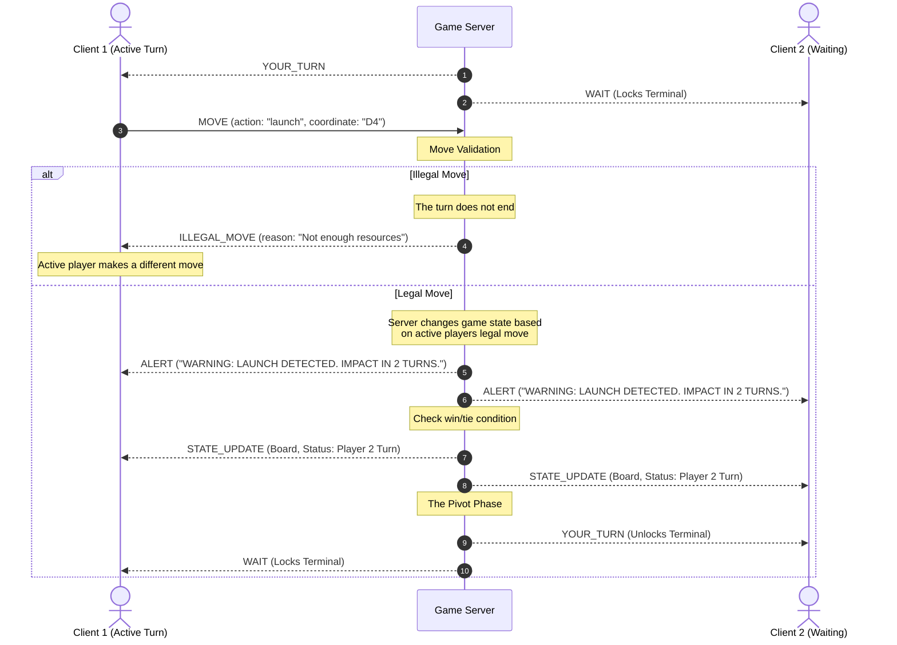

```mermaid
sequenceDiagram
    autonumber
    actor Client1 as Client 1 (Active Turn)
    participant Server as Game Server
    actor Client2 as Client 2 (Waiting)

   
    Server-->>Client1: YOUR_TURN 
    Server-->>Client2: WAIT (Locks Terminal)

    Client1->>Server: MOVE (action: "launch", coordinate: "D4")
    
    Note over Server: Move Validation
    
    alt Illegal Move
        Note over Server: The turn does not end
        Server-->>Client1: ILLEGAL_MOVE (reason: "Not enough resources")
        Note over Client1: Active player makes a different move
    else Legal Move
        Note over Server: Server changes game state based<br> on active players legal move
        Server-->>Client1: ALERT ("WARNING: LAUNCH DETECTED. IMPACT IN 2 TURNS.")
        Server-->>Client2: ALERT ("WARNING: LAUNCH DETECTED. IMPACT IN 2 TURNS.")
        
        Note over Server: Check win/tie condition
        Server-->>Client1: STATE_UPDATE (Board, Status: Player 2 Turn)
        Server-->>Client2: STATE_UPDATE (Board, Status: Player 2 Turn)
        
        Note over Server: The Pivot Phase
        Server-->>Client2: YOUR_TURN (Unlocks Terminal)
        Server-->>Client1: WAIT (Locks Terminal)
    end
```